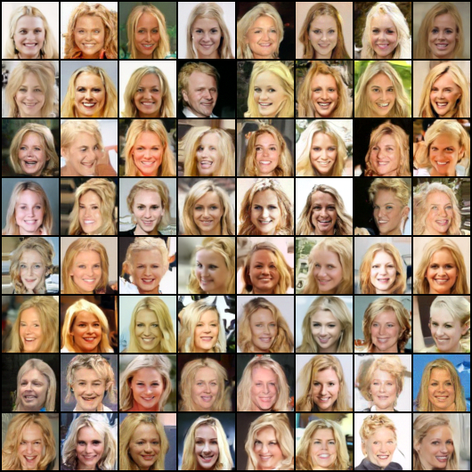
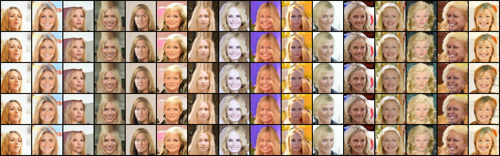

# From Conditional Flow Matching to Constraint-Aware Guidance

This repository presents the HW3 → HW4 research progression from CMU 10-799: Diffusion & Flow Matching (Spring 2026), by **Mu Chen**.

- **HW3 — establish:** train a semantic conditional Flow Matching model and verify that classifier-free guidance controls CelebA attributes.
- **HW4 — control:** freeze that generator, reuse its conditional/unconditional field pair, and select guidance online under target and preservation constraints.

[HW3 baseline](hw3/README.md) · [HW4 method](hw4/README.md) · [Paper](hw4/paper/main.pdf) · [Course poster](hw4/poster/crh_cfg_poster.pdf)

## Research arc

```text
Straight-path Flow Matching
        ↓ add discrete semantic conditioning + condition dropout
Frozen conditional/unconditional fields
        ↓ verify CFG controllability with an independent evaluator
HW3 baseline: fixed guidance w = 2
        ↓ expose candidate endpoints from the same affine field family
HW4 CRH-CFG: forecast → score → constrain → execute
```

The key bridge is the affine CFG field

$$
v_w=v_u+w(v_c-v_u),
$$

which HW3 uses at a fixed scale and HW4 turns into a discrete control bank. Under the frozen model's noise-to-data convention, every candidate has the analytic endpoint forecast

$$
\widehat{x}_0(w)=x_s+(1-s)v_w.
$$

That forecast lets an external evaluator choose among scales without additional generator forward evaluations.

## Headline evidence

| Stage | Main result | Honest boundary |
| --- | --- | --- |
| HW3 controllability | At $w=2$, predicted success is 99.6% for smiling, 96.9% for bangs, and 94.5% jointly for smiling/no-bangs/blond | One external evaluator; brown-hair evidence is weaker |
| HW3 speed side study | Heun does not improve the equal-NFE Pareto frontier over Euler | One frozen checkpoint and fixed grids |
| HW4 CRH-CFG | Comparable target success with matched generator NFE and about 1.1–2.7% measured runtime overhead | No common-reference preservation gain over ordinary conditional guidance |
| HW4 quality | KID moves differently across targets | Full-marginal KID cannot establish conditional quality improvement |





## Repository map

```text
hw3/                 Conditional GFM baseline, reports, configs, results, grids
hw4/                 CRH-CFG paper, poster, configs, results, and figures
src/methods/         Flow Matching training/sampling implementation
src/models/          Conditional U-Net and building blocks
src/data/            CelebA condition schema and loaders
src/*.py             HW4 controller, endpoint forecast, metrics, and sampling
scripts/             Independent HW3 attribute evaluator
tests/               CPU invariants for both stages
```

## Quick verification

The test suite uses synthetic tensors and requires neither CelebA nor a checkpoint.

```bash
git clone https://github.com/Woody-sudo/crh-cfg-flow-matching.git
cd crh-cfg-flow-matching
uv sync --dev
uv run pytest -q
```

## Reproduction boundary

The repository includes code, frozen configurations, exact aggregate tables, paper source, presentation artifacts, and unit tests. It intentionally excludes CelebA data, generator/evaluator checkpoints, cloud logs, and internal review material. See [HW4 reproducibility notes](hw4/docs/REPRODUCIBILITY.md) and the HW3 reports for the assets needed for full image generation.

## License and provenance

Code in this release is available under the [MIT License](LICENSE). The repository contains the author's course-project implementation and artifacts, not a redistribution of the full course starter repository. Paper, poster, figures, and result tables are provided for scholarly inspection and citation; third-party data, templates, and pretrained assets remain subject to their original terms.
