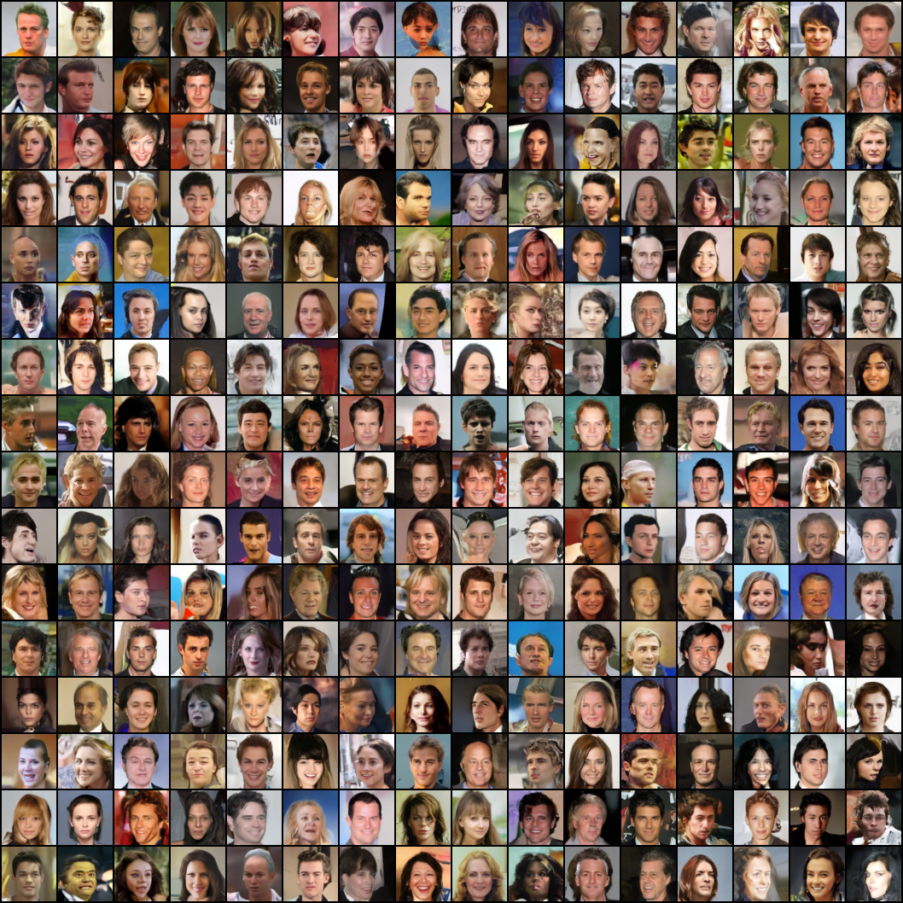
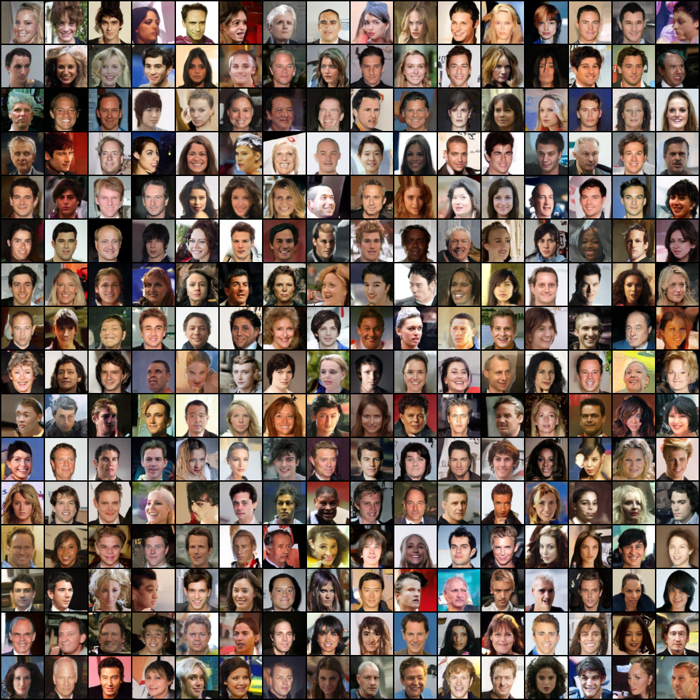

# HW3 solver-speed study

## Question and method

Can a second-order Heun solver improve the speed–quality frontier of the inherited straight-path Flow Matching checkpoint without retraining?

For step size $h$, Euler uses

$$
x_{n+1}=x_n+h v_\theta(x_n,t_n),
$$

while Heun predicts an endpoint and averages its two slopes:

$$
\widetilde{x}_{n+1}=x_n+h v_\theta(x_n,t_n),\qquad
x_{n+1}=x_n+\frac{h}{2}\left(v_\theta(x_n,t_n)+v_\theta(\widetilde{x}_{n+1},t_{n+1})\right).
$$

The correction doubles NFE per step. KID uses 1,000 generated images; timing covers 256 images on an NVIDIA L40S.

## Result

| Sampler | Steps | NFE | KID | Seconds/image |
| --- | ---: | ---: | ---: | ---: |
| Euler | 10 | 10 | 0.01744 | 0.00788 |
| Heun | 5 | 10 | 0.09411 | 0.00760 |
| Euler | 50 | 50 | 0.00693 | 0.02847 |
| Heun | 25 | 50 | 0.01861 | 0.02873 |
| Heun | 50 | 100 | 0.00558 | 0.05437 |

At equal NFE, Euler is clearly better. Heun-50 lowers KID by 19.5% relative to Euler-50 only by using 2× NFE and about 1.91× latency. It also essentially matches the earlier Euler-100 KID within reported KID variability. Therefore Heun does not improve the Pareto frontier for this checkpoint.

Full measurements: [`speed.csv`](../results/speed.csv).

